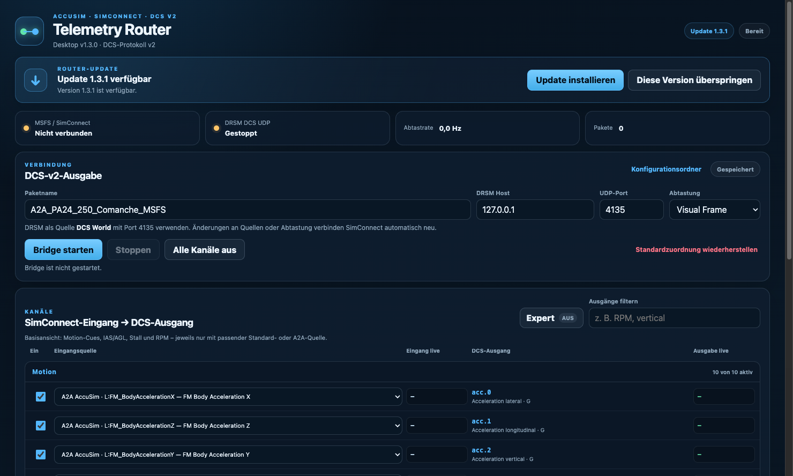

# AccuSim DRSM Telemetry Router

Windows telemetry bridge for the **A2A Simulations Accu-Sim Comanche**, Microsoft
Flight Simulator, and **DR Sim Manager (DRSM)**.

> [!IMPORTANT]
> This is a community-built interim solution. Its purpose is to make the
> Accu-Sim flight-model telemetry usable in DRSM until DRSM provides a native
> integration for these aircraft-specific values.



## Why this tool exists

The A2A Comanche uses a custom Accu-Sim flight model. Its most useful body-frame
acceleration values are exposed through aircraft-specific LVars rather than only
through the regular MSFS telemetry path:

```text
L:FM_BodyAccelerationX
L:FM_BodyAccelerationY
L:FM_BodyAccelerationZ
L:FM_BodyRotationAccelerationX
L:FM_BodyRotationAccelerationY
L:FM_BodyRotationAccelerationZ
```

Motion software needs acceleration, angular velocity, orientation, airspeed,
altitude, and engine data to create useful cues. The router reads both standard
SimVars and Accu-Sim LVars through SimConnect, converts their units, and sends a
compatible [DRSM DCS telemetry protocol v2](https://github.com/DepartedReality/dcs-telemetry)
packet over UDP.

It does not modify MSFS or DRSM, and it does not impersonate the DCS process.
DRSM simply receives the same open UDP/JSON format it supports for DCS World.

```text
MSFS + A2A LVars
        │ SimConnect
        ▼
Telemetry Router ── mapping / unit conversion ──► DCS v2 JSON over UDP
                                                        │
                                                        ▼
                                                       DRSM
```

## Features

- Basic mode with 14 relevant Comanche motion and engine channels
- Per-channel choice between a suitable standard SimVar and known Accu-Sim LVar
- Exact LVar names displayed directly in the source selector
- Live raw input and converted DCS output values
- Per-channel enable/disable and explicit inversion controls
- Automatic conversion between compatible physical units
- Safe Expert mode filters sources, units, and operations by output semantics
- Scale, offset, axis inversion, integration, and differentiation in Expert mode
- Full documented numeric DCS v2 output catalog in Expert mode
- Explicit red Raw mode for deliberately unrestricted experimental mappings
- User-defined LVars with add/remove controls
- SimConnect subscribes to enabled output sources plus a small fixed set of
  vertical-motion diagnostics used by CSV recording
- Automatically reconnecting SimConnect client
- Renderer updates freeze while the window is hidden or minimized; telemetry continues
- Installed app checks for updates at startup and offers install or per-version skip
- Download progress and an explicit restart action that stops the bridge safely
- Small web bootstrapper with automatic update support
- Optional VFR Multitool Tracker integration: install, update, start, stop, and
  open the complete Bridge settings directly from the Tracker
- True headless background mode for Tracker-managed sessions, using the same
  telemetry engine and saved configuration without creating a second UI or tray icon
- Local control channel with instance ownership, status reporting, and clean shutdown;
  an existing standalone Bridge installation is detected and reused
- Configurable UDP host, port, packet name, and sampling period
- Atomic persistent JSON configuration
- V2 motion mix enabled by default: standard `G FORCE` for heave, a drift-free
  Standard/AccuSim pitch-rate fusion, and direct standard roll/yaw rates
- One-click Legacy motion mix for comparison with the original all-A2A mapping
- Automatic A2A attitude compensation when `L:FM_BodyAccelerationY` is selected;
  it stays off for standard `G FORCE` so the `+1 G` resting load is not doubled
- Optional pitch/roll attitude mix up to 500% that deliberately restores a
  configurable share of sustained platform tilt without changing heave
- Bias-corrected A2A pitch detail with configurable blend, standard anchor and
  bias-learning time; Legacy A2A integration and residual washout remain available
- Optional ground-force mixer adds filtered standard lateral/longitudinal body
  acceleration to the AccuSim base only while on the ground, with independent
  blends, soft limits and smooth takeoff/touchdown transitions
- Ground acceleration compensation anchors slow cues to actual world-velocity
  change, rejecting static propeller thrust against held brakes while keeping
  real acceleration, braking, turns and fast surface impacts
- Ground heave stabilization blends continuously from
  `1 G + L:FM_BodyAccelerationY` to standard `G FORCE` after liftoff
- Optional shake mixer routes `L:AirframeShake`, `L:PanelVerticalShake`, and
  `L:PanelHorizontalShake` independently to lateral, longitudinal, and heave
  acceleration with a 0–200% matrix, inversion, centering, smoothing, and limits
- Optional turbulence mixer with five presets, band-pass, blend, gain, and soft G limit
- Independently adjustable vertical-wind branch with source, mix, gain, and sign controls
- Raw CSV diagnostics for A2A `AirframeShake`, vertical/horizontal panel shake,
  and the experimental `CameraHeight` value
- Persistent German/English interface, including tray, updater, status and validation messages
- Contextual tooltips explain every turbulence input, mapping control and DCS output field
- Bilingual output help describes axes, units and the intended DRSM use of fields such as `acc.1`
- Fixed three-element DCS vectors to prevent malformed Primary cue packets
- CSV recording of raw sources, routed outputs, telemetry gaps, gravity, and
  turbulence diagnostics

## Core Comanche mapping

| DRSM output | Default Accu-Sim/MSFS source | Conversion |
| --- | --- | --- |
| `acc[0]` lateral | `L:FM_BodyAccelerationX` | m/s² → G |
| `acc[1]` longitudinal | `L:FM_BodyAccelerationZ` | m/s² → G |
| `acc[2]` vertical | `G FORCE` | G → G |
| `ang_vel[0]` pitch | `ROTATION VELOCITY BODY X` + `L:FM_BodyRotationAccelerationX` | drift-free rad/s + bias-corrected A2A detail |
| `ang_vel[1]` roll | `ROTATION VELOCITY BODY Z` | rad/s → rad/s |
| `ang_vel[2]` yaw | `ROTATION VELOCITY BODY Y` | rad/s → rad/s |
| `pitch`, `roll`, `yaw` | standard MSFS orientation SimVars | degrees → radians |
| `ias` | `AIRSPEED INDICATED` | knots → m/s |
| `alt_agl` | `PLANE ALT ABOVE GROUND` | feet → metres |
| `rpm_left`, `prop_rpm` | `L:Eng1_RPM` | RPM |

V2 uses standard `G FORCE` as the vertical baseline because that source already
contains the positive resting load expected by DCS/DRSM. Gravity compensation is
therefore off in the V2 mapping. If `acc[2]` is changed to
`L:FM_BodyAccelerationY`, the router automatically enables the A2A processor:
it neutralizes the attitude-correlated lateral/longitudinal shares found in real
flight logs and adds the missing `+1 G` vertical baseline. At level attitude the
basis is `[0, 0, +1] G`; its compensation components change with pitch and bank.

The optional attitude mix is off by default. It adds a configurable counter-share
to the lateral/longitudinal compensation: `0%` keeps full A2A compensation, while
`100%` restores the attitude-correlated share. This allows a sustained platform
tilt during held pitch or bank without changing the vertical `+1 G` basis.

The optional ground-force mixer addresses the weak AccuSim lateral and
longitudinal cues observed during takeoff roll, braking, and ground turns. It
low-pass filters standard `ACCELERATION BODY X/Z`, applies independent mix and
soft-limit controls, and adds the result only to direct AccuSim `acc[0]/acc[1]`
mappings. `SIM ON GROUND` drives a continuous exponential blend: the last ground
sample fades out after liftoff instead of allowing airborne standard acceleration
to replace AccuSim. A channel already using standard acceleration receives no
second copy. Its DCS lateral sign is corrected so a left ground turn produces
the platform's expected rightward counter-tilt.

Two subordinate options are enabled by default whenever the ground-force mixer
is used. Acceleration compensation forms a complementary signal: slow lateral
and longitudinal motion comes from differentiating `VELOCITY WORLD X/Y/Z`, while
fast tire, brake and surface detail stays sourced from `ACCELERATION BODY X/Z`.
This prevents a sustained cue when propeller thrust is balanced by held brakes.
Ground heave stabilization uses `1 G + L:FM_BodyAccelerationY` on the ground and
fades continuously to standard `G FORCE` after liftoff, avoiding the one-frame
load discontinuity observed in takeoff recordings. Raw, kinematic, compensated
and heave-transition values are included in CSV diagnostics.

The optional turbulence mixer leaves the original acceleration intact. It
isolates a configurable fast band (default `0.7–5 Hz`) and blends only that
component into vertical acceleration. A second optional branch differentiates
vertical wind velocity into acceleration, filters it separately, and adds it to
the main turbulence component. `AIRCRAFT WIND Y` is the recommended starting
source; `AMBIENT WIND Y` and `RELATIVE WIND VELOCITY BODY Y` are available for
comparison. Both additions share one adjustable soft limit and are off by
default for safe initial testing. After a telemetry gap longer than `250 ms`,
the filter state is reset and only the added turbulence component is suppressed
for `750 ms` while normal flight-model telemetry continues to be sent.

The optional shake mixer keeps all three dimensionless A2A signals separate from
the ground-force and turbulence processors. It normalizes each source against a
conservative reference level and subtracts a slowly tracked centre, so an
unsigned or constant shake value cannot create a persistent platform offset.
The resulting impulses pass through a user-configurable 3×3 matrix into DCS
lateral, longitudinal, and heave acceleration, then through a symmetrical soft
limit per axis. The safe default routing uses Panel Vertical for heave, Panel
Horizontal for lateral motion, and a weaker Airframe contribution on all axes;
the entire processor is off by default. Raw values, centred bands, normalized
signals, individual contributions, and applied output are recorded in CSV.

Five presets provide repeatable starting points. Selecting one enables the
mixer and copies its values into the normal controls; every value can still be
edited afterwards.

| Preset | Mix | Gain | Band | Extra soft limit | Intended use |
| --- | ---: | ---: | ---: | ---: | --- |
| Light | 25% | 1.6× | 0.9–4 Hz | 0.08 G | Subtle air movement |
| Medium | 50% | 2.5× | 0.7–5 Hz | 0.20 G | Balanced default |
| Strong | 75% | 3.5× | 0.5–7 Hz | 0.30 G | Clearly noticeable turbulence |
| High | 100% | 5.0× | 0.3–10 Hz | 0.50 G | Former Extreme preset, validated in flight |
| Extreme | 100% | 7.0× | 0.2–14 Hz | 0.75 G | Stronger diagnostic tests only |

The `?` controls explain how mix, gain, cutoff frequencies, source choice, and
the soft limit affect the output. Extreme settings can cause DRSM axis
overallocation and should be approached gradually.

The default V2 pitch path starts with the direct, drift-free MSFS body rate. It
learns the persistent offset of the A2A pitch angular acceleration and adds only
its fast, bias-corrected detail at a configurable blend (55% by default). Roll
and yaw use the direct standard body rates because the recorded standard and A2A
motion were nearly identical on those axes, avoiding integration drift entirely.
The Legacy switch restores A2A angular-acceleration fusion on all three axes,
including attitude-based drift correction and the optional residual washout.
Pure integration remains available in Expert mode for diagnostic comparison.

## Quick start

1. Download the latest
   [Windows setup bootstrapper](https://github.com/iNherjer/AccuSim-DRSM-Telemetry-Router/releases/latest/download/AccuSim-DRSM-Telemetry-Router-Setup.exe).
2. Start Microsoft Flight Simulator and load the A2A Comanche.
3. In DRSM, select **DCS World** as the telemetry source and use UDP port `4135`.
4. Start the installed **AccuSim DRSM Telemetry Router**.
5. Click **Bridge starten**.

For a diagnostic log, click **CSV aufnehmen** after the bridge is running and
**CSV stoppen** when the manoeuvre is complete. The focused diagnostic set is
sampled even when those values are not routed to DCS. It includes A2A and stock
vertical acceleration, world acceleration, G force, aircraft/ambient/relative
vertical wind, body/world vertical velocity, cloud density, pitch rate, pitch,
elevator input, `L:AirframeShake`, `L:PanelVerticalShake`,
`L:PanelHorizontalShake`, and the experimental `L:CameraHeight`.

Do not run another DCS-format telemetry sender to the same DRSM endpoint at the
same time, or DRSM may receive conflicting packets.

## Basic and Expert modes

Basic mode intentionally stays small. It shows linear acceleration, angular
velocity, pitch/roll/yaw, IAS, AGL, stall warning, and engine/propeller RPM.
Only appropriate standard and A2A sources are offered for each output.

Expert mode exposes every documented numeric DCS v2 field, compatible built-in
and custom sources, input units, mathematical operations, scale, and offset.
The source list is also filtered semantically: an acceleration output offers
acceleration sources, while an RPM output offers engine/propeller RPM sources.
Optional fields such as individual gear positions, control surfaces, weapons,
and damage remain available there without cluttering the normal Comanche
workflow.

Input units and operations are constrained to combinations that can actually
produce the selected output. For example, velocity may be differentiated into
acceleration, but `mph` cannot be relabelled as G or RPM. Existing or deliberate
experimental mappings can still be edited in the clearly marked red **Raw**
mode. Runtime validation remains active, so incompatible channels are not sent.

## Configuration

The app saves its configuration to:

```text
Documents\VFR Multitool\AccuSim DRSM Router\bridge-config.json
```

CSV recordings are stored in:

```text
Documents\VFR Multitool\AccuSim DRSM Router\logs
```

Closing the window hides the app in the Windows tray. Use the tray menu to stop
the bridge or quit the application completely. While hidden or minimized, the
Chromium renderer receives no live telemetry snapshots. SimConnect processing
and UDP output continue normally, and the UI receives one current snapshot when
it is shown again.

The default V2 profile maps 14 output channels and also samples 29 focused
diagnostic candidates, with all overlaps and the additional pitch-rate anchor
deduplicated. This results in 35 values per visual frame in the default
configuration. Shared
inputs such as `L:Eng1_RPM` are subscribed only once. Changing scale or offset
does not reconnect SimConnect; changing an enabled channel's source or sampling
period rebuilds the compact subscription automatically.

## Updates and installation

The installed Windows app checks the latest public GitHub release at startup.
When a newer version is available, it offers **Install update** or **Skip this
version**. A skipped version stays suppressed on automatic startup checks; a
manual check from the app header or tray can offer it again. Telemetry continues
while the update downloads. The bridge is stopped only after the user confirms
the restart, and a downloaded update is also installed on the next real app
exit.

Every release used by the updater must publish these files from the same build:

- `AccuSim-DRSM-Telemetry-Router-Setup.exe`
- `accusim-drsm-telemetry-router-<version>-x64.nsis.7z`
- `latest.yml`

Draft releases are not part of the update channel.

When migrating from an older portable build, the bootstrapper also detects
router processes outside the installation directory. It warns before stopping
the active bridge, closes both installed and portable process names, and avoids
the old tray instance reclaiming Electron's single-instance lock after setup.

## Development

Requirements:

- Node.js 22 or newer
- Windows for live SimConnect testing
- MSFS SimConnect runtime

```bash
npm ci
npm test
npm start
```

Build the x64 Windows bootstrapper and updater payload:

```bash
npm run build:win
```

The bootstrapper, payload, and `latest.yml` metadata are written below
`dist/nsis-web/`.

## Current status and limitations

- The current mapping is validated against recorded A2A Comanche telemetry, but
  real motion-platform tuning remains profile- and hardware-dependent.
- Standard MSFS angular velocities are the safe default. Integrated rotational
  acceleration is experimental and may drift.
- The app currently targets Windows x64 and local SimConnect.
- This bridge is intentionally temporary infrastructure, not a replacement for
  a future native DRSM source implementation.

Please use this repository's issue tracker for router problems. Do not ask A2A
Simulations or Departed Reality to support this unofficial community tool.

## Disclaimer

This project is not affiliated with, endorsed by, or supported by A2A
Simulations, Departed Reality, Microsoft, or Eagle Dynamics. Product and company
names belong to their respective owners.

## License

[MIT](LICENSE)
